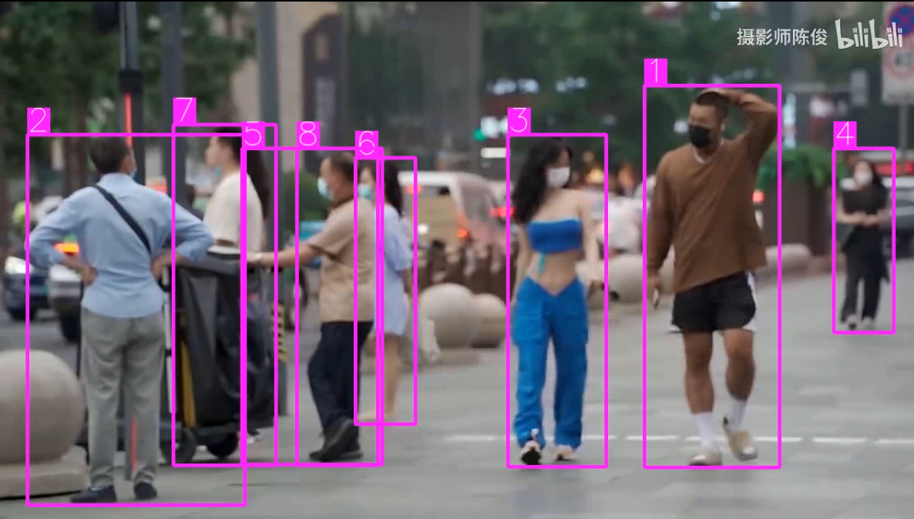
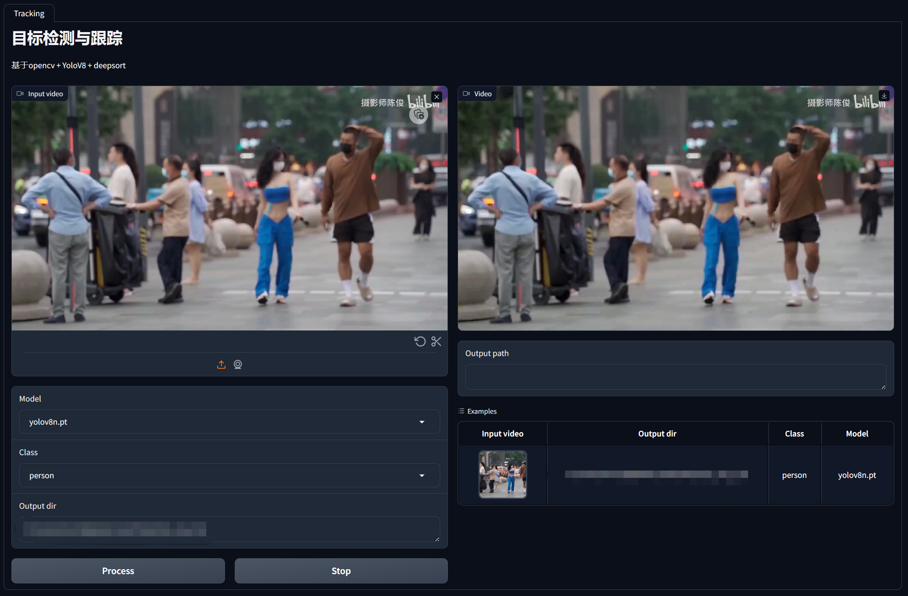

<div align="center">
<h1> yolov8-deepsort-tracking </h1>

[](https://huggingface.co/spaces/KdaiP/yolov8-deepsort-tracking)
</div>



opencv+yolov8+deepsort的行人检测与跟踪。当然，也可以识别车辆等其他类别。

# 更新历史

2024/3/5：YoloV9模型已添加至WebUI。

2024/2/11更新：清理代码，完善注释。WebUI新增识别目标选择、进度条显示、终止推理、示例等功能。

2023/10/17更新：简化代码，删除不必要的依赖。解决webui上传视频不会清空tracker ID的问题。

2023/7/4更新：加入了一个基于Gradio的WebUI界面

## 安装
环境：Python>=3.8

本项目需要pytorch，建议手动在[pytorch官网](https://pytorch.org/get-started/locally/)根据自己的平台和CUDA环境安装对应的版本。

pytorch的详细安装教程可以参照[Conda Quickstart Guide for Ultralytics](https://docs.ultralytics.com/guides/conda-quickstart/)

安装完pytorch后，需要通过以下命令来安装其他依赖：

```shell
$ pip install -r requirements.txt
```

如果需要使用GUI，需要通过以下命令安装tqdm进度条和Gradio库：

```shell
$ pip install tqdm gradio
```


## 配置(非WebUI)

在main.py中修改以下代码，将输入视频路径换成你要处理的视频的路径：

```python
input_path = "test.mp4"
```

模型默认使用Ultralytics官方的YOLOv8n模型：

```python
model = YOLO("yolov8n.pt")
```

其他支持的模型可以参照[ultralytics官方支持的模型列表](https://docs.ultralytics.com/models/)
例如，如果想要使用YOLOv9模型：

```python
model = YOLO("yolov9c.pt")
```

第一次使用时，会自动从官网下载模型。如果网速过慢，可以在[ultralytics的官方文档](https://docs.ultralytics.com/tasks/detect/)下载模型，然后将模型文件拷贝到程序所在目录下。

## 运行(非WebUI)

运行main.py

推理完成后，终端会显示输出视频所在的路径。

## WebUI界面的配置和运行

demo: [Huggingface demo](https://huggingface.co/spaces/KdaiP/yolov8-deepsort-tracking)


运行app.py，如果控制台出现以下消息代表成功运行：
```shell
Running on local URL:  http://127.0.0.1:6006
To create a public link, set `share=True` in `launch()`
```

浏览器打开该URL即可使用WebUI界面



